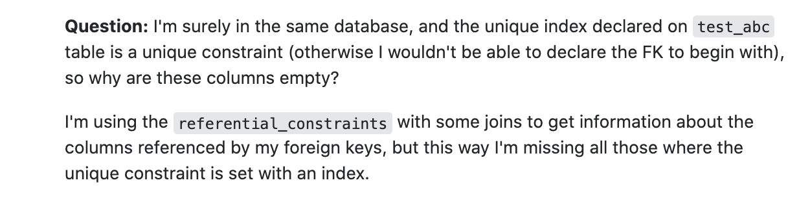

Quality over quantity, I’m sure we’ve all heard this illustrious three word phrase before. This saying resonates with me because it can be used in all aspects of my life. Creating habits, new experiences, even just simply having fun with a friend, as those quality moments will last a longtime. I’ve always believed that being more meaningful and living with intention will better yourself on a day to day. Asking questions is a part of that process, you won’t always understand something and when that happens you don’t want to ask yourself the same questions over and over again. That is why coming up with a “smart” question is so important as it will lead to a more efficient answer. 

# What is a “smart” question

Header: NULL values for referential_constraints.unique_constraint_* in information schema

In the software engineering space questions arise daily. As of right now there are over 21 million questions on stack overflow, a question and answer website used from amateurs to professionals. With that kind of magnitude not every question will be answered. So as the “interviewee” you want to maximize the quality of your question so it can reach the masses. To do this we want to first start with the header, arguably the most important component as it will make and break your question getting answered. We want to specify the group of the problem along with a brief part that describes its expected behavior. Once our question gets seen we want to clearly explain the issue. As we want quality and informative answers we want to give quality and informative details of our problem. It's a win-win, for all parties, you will find the answer you were looking for, the answerer will be able solve a thought-provoking question where they may also learn from it, and other users who may have the same question can just come to your post. Asking a question with quality will save time, effort, and come along with quality answers.   

# Asking a question in a “smart way”
Header: What is the output of the following line of code?

Here is an example of a question being asked in a [“smart way”](https://stackoverflow.com/questions/61249732/null-values-for-referential-constraints-unique-constraint-columns-in-informati).

  
  

This developer asks a question in a “smart way”, with glance we can see that this question contains the specified area which pertains to the problem as well as its expected behavior. In their body of text, the question can be seen clearly as it is bolded for others to see. The developer of this question also provides details in code. Because of these qualities the developer receives a quality answer. We can see that in the replies to this question the answers provide a summary of the problem, code, bolded answer key, and other solutions.    

# Asking a question in a “not smart way”        

Here is an example of a question being asked in a [“not smart way”](https://stackoverflow.com/questions/46439153/what-is-the-output-of-the-following-line-of-code).

As we can see this developer is as if asking the members of stack overflow to do the work for them. The developer does not mention the expected behavior in the header. In their body of text, we don’t see a quality question and no details regarding an issue. We can see by the comments made by stack overflow users that they are not contemptuous with this problem.  

