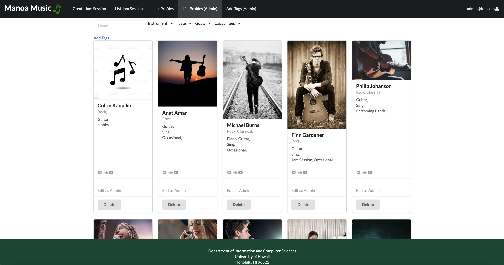

## Overview
The Manoa Music application is a website which allows UH Students and community members alike to find others with musical talents/interests. Using Javascript, Meteor, Uniforms, and Semantic UI as a group we developed a website that executes this idea. With features such as creating a profile, being able to view other profiles, and creating Jam Sessions to schedule meetings up with other musicians.     

## Contributions
I mainly worked on the list profiles page for user and admin with functionality for editing and deletion for the admin side. I also worked on Jam Sessions and Profile Page for each profile.

#### Profiles Page

#### List Profiles Page

#### List Profiles Page (Admin)

#### Jam Sessions

## What I Learned
This project taught me development skills with the new technologies we learned and used. However, I think the most important skill I learned throughout this project and got better at was time management. During this project I realized how important communication is for time management. From the beginning of being tasked with a group till the last day to turn in our project we had communicated everyday. Setting meeting times, discussing new ideas, and solving tasks together. I felt that with my group we had always been on top of time management and that's why we were able to be on task to finish this project efficiently.

For more information here is project on [GitHub](https://github.com/manoa-music). and the home page for the project can be found [here](https://manoa-music.github.io/).  
