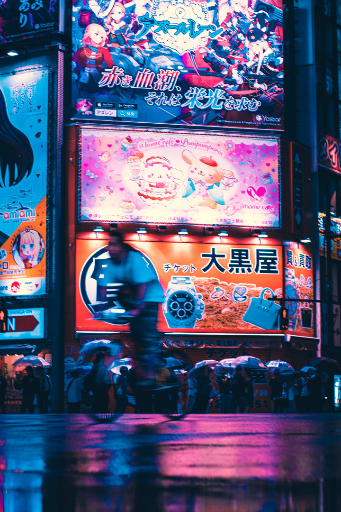

When something piques my interest I consider one of my greatest strengths to be entering a "flow state" or thats what I like to call it. When your dedication towards a craft has 110% of your attention. 

I was introduced to photography as a freshmen in highschool and instantly, I fell in love. I loved the idea of capturing images, a moment and telling a story. I put hours into learning composition, lighting, and different editing techniques. 

My photography teacher had told us about the JCCH Photography contest that was coming up and recommended to enter. They wanted us to capture a image that reflected upon the 150 years of Japanese in Hawaii in one image. As a Japanese myself the one place that I thought of was the Izumo Taishakyo temple. This place was very special to me as every year me and my family would go here to pray for our well being and safety for the rest of the year. So I felt that it was only right for it to be here. For the image I took I wanted it to have a film-ish look similar to how it would of been taken 100+ years ago.

With this I received an honorable mention and some money which went back into my hobby for photography to buy my a camera. 

